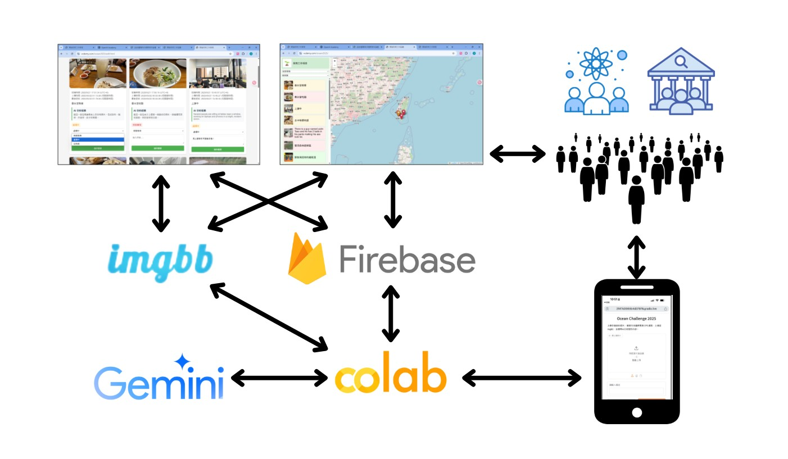

# 2025 International Conference on Marine Environmental Management

**Title**: AI-assisted Preservation Tracker (APT)

**Authors**: Tiffany Gau, Megan Chang, Oliver Chen, Daniel Gau

## Introduction

Marine plastic pollution has become a pervasive global issue, threatening ecosystems, biodiversity, and human well-being. Effective monitoring is critical, yet current approaches remain fragmented. Reviews of citizen science initiatives reveal key gaps: limited coverage in developing regions, inconsistent methodologies, vague reporting on participants, and a lack of harmonized litter classification standards, all of which reduce comparability and hinder large-scale analysis (Hidalgo-Ruz et al., 2025).

Professionals working with citizen science projects also highlight both benefits and persistent challenges: public learning, reduced data collection costs, and tangible environmental improvements on the one hand, but difficulties in sustaining volunteer engagement, ensuring credibility, and bridging citizen–science divides on the other (Peacock et al., 2025). These shortcomings point to the need for next-generation systems that are more scalable, cost-efficient, and engaging.

Our proposed system, the AI-assisted Preservation Tracker (APT), seeks to address these challenges. Unlike existing platforms such as PlastOPol, which rely on repeated retraining of object detection models, APT leverages large language models (LLMs) to achieve higher recognition accuracy with lower retraining costs, simplifying the pipeline and reducing technical overhead. In addition to litter monitoring, APT also considers broader applications in biodiversity observation, eco-tourism, and environmental education—areas where public participation can play a decisive role in building stewardship.

Slides： https://youtu.be/MTMq_1SaROM?si=EQl_TyusV4Ze4J36

## System Architecture



## How it works?

1. Users upload photos via their mobile devices and provide a description of each photo.
2. Once the server receives the photo, it performs the following steps:
    1. The photo is sent to an LLM for analysis, which generates an interpretation and a suggested status for follow-up.
    2. The server extracts the GPS coordinates and timestamp from the photo.
    3. If the photo contains GPS metadata:
        1. The server uploads the photo to a geospatial storage service and retrieves a URL for the image.
        2. The server stores the photo’s URL, the user’s description, the AI analysis results, the AI-suggested status, the GPS coordinates, and the timestamp in the database.
3. Users can view the current status of submitted reports through a web interface.
4. Administrators can update the status of each report via a backend management interface.

## Technology Used

**Colab**:

* [Colab Main Program](https://colab.research.google.com/drive/1X-2Dr2H7feQ66fW7T07c6aqWUjrmAIno?usp=sharing)

**LLM**

* [Google Gemini API](https://aistudio.google.com/)

**Image Hosting**

* [imgbb](https://imgbb.com/)

**Voice Hosting**

* [vocaroo](https://vocaroo.com/)

**Database**

* [firebase](https://firebase.google.com/)
* [supabase](https://supabase.com/)

**WebGIS**

* [leaflet.js](https://leafletjs.com/)

## Demo Websites

[Task List](https://allergicalligator.github.io/ocean_challenge_2025)

[Task Control Panel](https://allergicalligator.github.io/ocean_challenge_2025/update.html)

Note that, for security purposes, the firestore access would have been set to readonly.

```
service cloud.firestore {
  match /databases/{database}/documents {
    match /{document=**} {
      allow read: if true;     // allow read
      allow write: if false;   // not allow write
    }
  }
}
```

## References (APA Style)

* Kelly, R., Fleming, A., Pecl, G. T., von Gönner, J., & Bonn, A. (2020). Citizen science and marine conservation: A global review. Philosophical Transactions of the Royal Society B, 375(1794), Article 20190461. https://doi.org/10.1098/rstb.2019.0461
* McVeigh, K. (2025, June 14). Is the ocean ‘having a moment’? This was the UN summit where the world woke up to the decline of the seas. The Guardian. Retrieved from https://www.theguardian.com/environment/2025/jun/14/is-the-ocean-having-a-moment-this-was-the-un-summit-where-the-world-woke-up-to-the-decline-of-the-seas
* Oceana Europe. (2025, March). Briefing: The EU Ocean Pact and marine protected areas. https://europe.oceana.org/wp-content/uploads/sites/26/2025/03/BRIEFING-the-EU-Ocean-Pact-and-Marine-Protected-Areas-for-screens.pdf
* Peterson, E. E., Santos‑Fernández, E., Chen, C., Clifford, S., Vercelloni, J., Pearse, A., Brown, R., Christensen, B., James, A., Anthony, K., Loder, J., González‑Rivero, M., Roelfsema, C., Caley, M. J., Bednarz, T., & Mengersen, K. (2019). Monitoring through many eyes: Integrating disparate datasets to improve monitoring of the Great Barrier Reef (arXiv:1808.05298). arXiv. https://doi.org/10.48550/arXiv.1808.05298
* Sandahl, A., & Tøttrup, A. P. (2020). Marine citizen science: Recent developments and future recommendations. Citizen Science: Theory and Practice, 5(1), Article 24. https://doi.org/10.5334/cstp.270
* Stockholm Resilience Centre. (2024, January 26). Over 80% of the European Union’s marine protected area only marginally regulates human activities. Stockholm Resilience Centre. https://www.stockholmresilience.org/publications/publications/2025-01-26-over-80-of-the-european-unions-marine-protected-area-only-marginally-regulates-human-activities.html
* Hidalgo-Ruz, V., Cózar, A., Vioque, J., Henríquez-Hernández, L. A., & Hernández-Borges, J. (2023). PlastOPol: A citizen science-based system for monitoring marine litter using artificial intelligence and geospatial technologies. Environmental Modelling & Software, 167, 105775. https://doi.org/10.1016/j.envsoft.2023.105775
* Peacock, E. E., Papadopoulou, K.-N., O’Connor, I., Lopes, C., Smith, L., Maes, T., ... & Galgani, F. (2025). Benefits and challenges of citizen science for marine litter research: Insights from practitioners. Marine Pollution Bulletin, 210, 115580. https://doi.org/10.1016/j.marpolbul.2025.115580
* Kawabe, L. A., Blettler, M. C. M., & Syakti, A. D. (2022). Citizen science in marine litter research: A review. Marine Pollution Bulletin, 185, 114262. https://doi.org/10.1016/j.marpolbul.2022.114262
